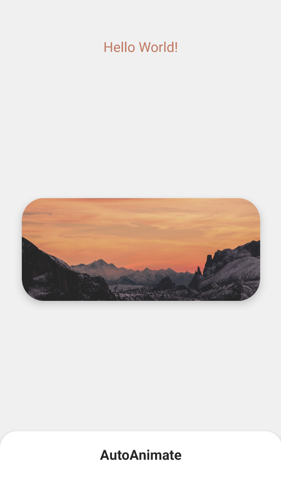
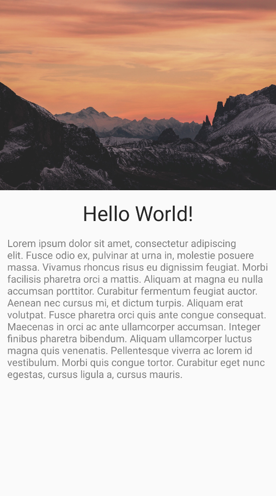

# AutoAnimate
[](http://developer.android.com/index.html)
[](https://android-arsenal.com/api?level=21)
[](https://search.maven.org/artifact/io.github.aghajari/AutoAnimate/1.0.2/aar)
[](https://gitter.im/Aghajari/community?utm_source=badge&utm_medium=badge&utm_campaign=pr-badge&utm_content=badge)

**AutoAnimate** is a custom Shared Element Transition that automatically animates your views based on Figma Smart Animate.

| FragmentA | FragmentB | Transition |
| :---: | :---: | :---: |
|  |  |  |

**Supports:**
- [x] Layout
- [x] Scale
- [x] Rotation
- [x] Translation
- [x] Background
- [x] Color
- [x] TextSize
- [x] TextColor
- [x] CornerRadius
- [x] Elevation

You can customize duration, delay, interpolator and every other properties!

## Installation

**AutoAnimate** is available in the `mavenCentral()`, so you just need to add it as a dependency (Module gradle)

Gradle
```gradle
implementation 'io.github.aghajari:AutoAnimate:1.0.2'
```

Maven
```xml
<dependency>
  <groupId>io.github.aghajari</groupId>
  <artifactId>AutoAnimate</artifactId>
  <version>1.0.2</version>
  <type>pom</type>
</dependency>
```

## Usage

- Step1: Create your fragments (or activities)
- Step2: Design your layouts
- Step3: Set `sharedElementEnterTransition`
- Step4: Add your views to FragmentTransaction by `addSharedElement`
- Step5: Done!

```kotlin
val autoAnimateTransition = AutoAnimateTransition.build(
    duration = 500,
    interpolator = OvershootInterpolator()
)

fragment.sharedElementEnterTransition = autoAnimateTransition
sharedElementReturnTransition = autoAnimateTransition

supportFragmentManager
    .beginTransaction()
    .addToBackStack(null)
    .addSharedElement(view, view.transitionName)
    .replace(R.id.container, fragment)
    .commit()
```

## Example

- Step1: Create FragmentA and its layout:


<details><summary><b>Click to see FragmentA layout</b></summary>
<p>

```xml
<?xml version="1.0" encoding="utf-8"?>
<FrameLayout xmlns:android="http://schemas.android.com/apk/res/android"
    xmlns:tools="http://schemas.android.com/tools"
    android:layout_width="match_parent"
    android:layout_height="match_parent"
    tools:context=".FragmentA">

    <View
        android:id="@+id/shape"
        android:transitionName="shape"
        android:layout_gravity="center"
        android:layout_width="56dp"
        android:layout_height="56dp"
        android:background="@drawable/bg_a" />

</FrameLayout>
```

</p></details>

- Step2: Create FragmentB and its layout:


<details><summary><b>Click to see FragmentB layout</b></summary>
<p>

```xml
<?xml version="1.0" encoding="utf-8"?>
<FrameLayout xmlns:android="http://schemas.android.com/apk/res/android"
    xmlns:tools="http://schemas.android.com/tools"
    android:layout_width="match_parent"
    android:layout_height="match_parent"
    tools:context=".FragmentB">

    <View
        android:id="@+id/shape"
        android:transitionName="shape"
        android:layout_gravity="center_horizontal"
        android:layout_marginTop="56dp"
        android:layout_width="56dp"
        android:layout_height="56dp"
        android:scaleX="2"
        android:scaleY="2"
        android:background="@drawable/bg_b" />

</FrameLayout>
```

</p></details>


- Step3: Start FragmentB by clicking on shape and Done!

<details><summary><b>Click to see the source</b><br><br>

```kotlin
private val autoAnimateTransaction = AutoAnimateTransaction.build(
    duration = 800,
    interpolator = OvershootInterpolator()
)
```

</summary>
<p>

```kotlin
class FragmentA : Fragment() {

    override fun onCreateView(
        inflater: LayoutInflater, container: ViewGroup?,
        savedInstanceState: Bundle?
    ): View {
        return FragmentABinding.inflate(inflater).apply {
            shape.setOnClickListener { startFragment(FragmentB(), shape) }
        }.root
    }
}

class FragmentB : Fragment() {

    override fun onCreateView(
        inflater: LayoutInflater, container: ViewGroup?,
        savedInstanceState: Bundle?
    ): View {
        return FragmentBBinding.inflate(inflater).apply {
            shape.setOnClickListener { popBackStack() }
        }.root
    }
}

fun Fragment.startFragment(fragment: Fragment, view: View) {
    fragment.sharedElementEnterTransition = autoAnimateTransaction
    sharedElementReturnTransition = autoAnimateTransaction

    requireActivity()
        .supportFragmentManager
        .beginTransaction()
        .addToBackStack(null)
        .addSharedElement(view, view.transitionName)
        .replace(R.id.container, fragment)
        .commit()
}
```

</p></details>

## Customize Properties

```kotlin
private val autoAnimateTransaction = AutoAnimateTransaction.build(
    mapOf(
        "shape" to listOf(
            LayoutAutoAnimate().apply {
                maxFraction = 1f
            },
            BackgroundAutoAnimate().apply {
                interpolator = LinearInterpolator()
                duration = 400
            },
            ScaleYAutoAnimate(),
            ScaleXAutoAnimate().apply {
                startDelay = 200
            },
        )
    ),
    duration = 800,
    interpolator = OvershootInterpolator()
)
```

| Transition | Customized |
| :---: | :---: |
|  |  |
